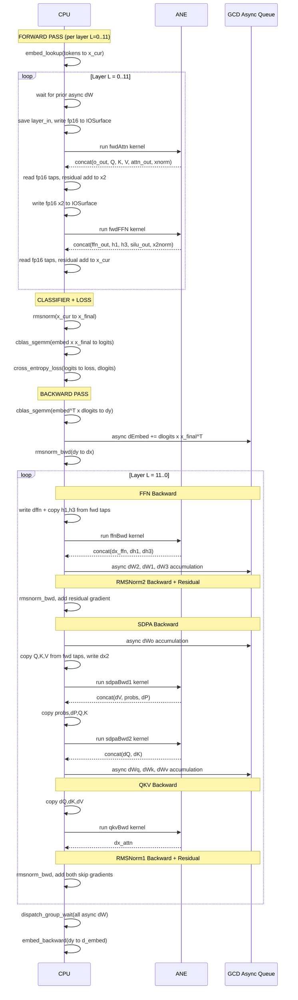
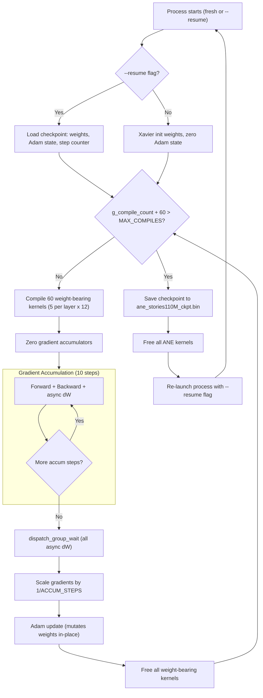
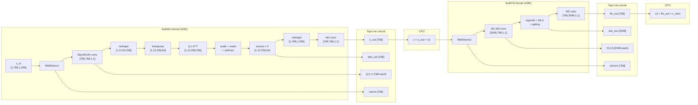

# ANE Training -- System Architecture

Training neural networks directly on Apple's Neural Engine via reverse-engineered private APIs (`_ANEClient`, `_ANECompiler`). No CoreML training APIs, no Metal, no GPU.

## Project Structure

```
ANE/
+-- api_exploration.m          # ANE private API discovery
+-- inmem_basic.m              # In-memory MIL compilation proof-of-concept
+-- inmem_bench.m              # ANE dispatch latency across model sizes
+-- inmem_peak.m               # Peak TFLOPS via deep conv chains (self-contained)
+-- sram_bench.m               # SRAM capacity probing (performance cliff detection)
+-- sram_probe.m               # Fine-grained SRAM size exploration
+-- bridge/
|   +-- ane_bridge.h           # C-callable API for Python ctypes
|   +-- ane_bridge.m           # Bridge implementation
|   +-- Makefile               # Builds libane_bridge.dylib
|   +-- libane_bridge.dylib    # Pre-built shared library
+-- training/
|   +-- train_large.m          # Main: 12-layer training (CPU classifier)
|   +-- train_large_ane.m      # Variant: classifier + softmax on ANE
|   +-- stories_config.h       # Model constants, structs, alloc helpers
|   +-- stories_io.h           # IOSurface I/O, NEON fp16, compile/run
|   +-- stories_mil.h          # MIL generators for 6 fused ANE kernels
|   +-- stories_cpu_ops.h      # vDSP RMSNorm, cross-entropy, Adam, embedding
|   +-- ane_runtime.h          # Generalized ANE wrapper (multi-I/O)
|   +-- ane_mil_gen.h          # Composable MIL helpers (conv, matmul, fused QKV)
|   +-- ane_rmsnorm_bwd.h      # RMSNorm backward MIL (train_large_ane only)
|   +-- ane_classifier.h       # Classifier/softmax MIL (train_large_ane only)
|   +-- forward.h              # Gen1 forward pass (per-linear-kernel, all-CPU)
|   +-- backward.h             # Gen1 backward pass (all-CPU reference)
|   +-- model.h                # Gen1 Model struct, per-kernel compile
|   +-- dashboard.py           # TUI monitoring (loss, power, text generation)
|   +-- tokenize.py            # Extract pretokenized TinyStories data
|   +-- download_data.sh       # Download TinyStories from HuggingFace
|   +-- Makefile               # Build targets for training + tests
|   +-- test_*.m               # 12 unit test files
+-- docs/                      # This documentation
+-- scripts/                   # Automation scripts
```

## Two Generations of Training Code

### Gen1: `model.h` + `forward.h` + `backward.h`

The original correctness reference. One ANE kernel per linear projection (7 per layer + 1 classifier = 85 kernels total). Forward and backward are sequential all-CPU operations with optional ANE for the matmuls. No kernel fusion, no async overlap. Used for verifying Gen2's fused kernels produce correct results.

### Gen2: `train_large.m` + `stories_*.h` (production)

The performance-optimized system. Uses **5 fused ANE kernels per layer** (each performing multiple operations in a single dispatch). Weight gradients (`dW`) run asynchronously on CPU via GCD to overlap with ANE. All data is channel-first `[C, S]` fp16 on IOSurfaces.

The rest of this document describes Gen2.

---

## Model Configuration

Stories110M -- a Llama2-architecture transformer:

| Parameter | Value | Macro |
|-----------|-------|-------|
| Hidden dimension | 768 | `DIM` |
| FFN intermediate | 2048 | `HIDDEN` |
| Attention heads | 12 | `HEADS` |
| Head dimension | 64 | `HD` |
| Sequence length | 256 | `SEQ` |
| Layers | 12 | `NLAYERS` |
| Vocabulary | 32000 | `VOCAB` |
| Total parameters | 109.53M | `TOTAL_PARAMS` |
| Accumulation steps | 10 | `ACCUM_STEPS` |
| Max ANE compiles | 100 | `MAX_COMPILES` |

---

## ANE Kernel Fusion Map

Each training step dispatches 6 kernel types per layer. 5 are weight-bearing (recompiled each batch), 1 is weight-free (compiled once).

| Kernel | Generator | Fused Operations | Baked Weights | Input Shape | Output Shape |
|--------|-----------|-----------------|---------------|-------------|--------------|
| `fwdAttn` | `gen_sdpa_fwd_taps()` | RMSNorm1, Wq/Wk/Wv conv, reshape, transpose, Q at K^T matmul, scale, causal mask, softmax, scores at V matmul, Wo conv | rms_att, Wq, Wk, Wv, Wo, mask | `[1,DIM,1,SEQ]` | `[1,6*DIM,1,SEQ]` |
| `fwdFFN` | `gen_ffn_fwd_taps()` | RMSNorm2, W1/W3 conv, sigmoid, SiLU gating, W2 conv | rms_ffn, W1, W3, W2 | `[1,DIM,1,SEQ]` | `[1,2D+3H,1,SEQ]` |
| `ffnBwd` | `gen_ffn_bwd()` | W2^T conv, SiLU derivative, W1^T/W3^T conv, add | W2^T, W1^T, W3^T | `[1,D+2H,1,SEQ]` | `[1,D+2H,1,SEQ]` |
| `sdpaBwd1` | `gen_sdpa_bwd1()` | Wo^T conv, reshape, Q at K^T recompute, softmax, dV matmul, dP matmul | Wo^T, mask | `[1,4*DIM,1,SEQ]` | `[1,D+2*SC,1,SEQ]` |
| `sdpaBwd2` | `gen_sdpa_bwd2()` | softmax Jacobian, scale, dQ=dS at K matmul, dK=dS^T at Q matmul | _(none)_ | `[1,2SC+2D,1,SEQ]` | `[1,2*DIM,1,SEQ]` |
| `qkvBwd` | `gen_qkvb()` | Wq^T/Wk^T/Wv^T conv, sum | Wq^T, Wk^T, Wv^T | `[1,3*DIM,1,SEQ]` | `[1,DIM,1,SEQ]` |

Where D=DIM=768, H=HIDDEN=2048, SC=SCORE_CH=HEADS*SEQ=3072.

"Taps" in forward kernels: intermediate values (Q, K, V, attention output, norms) are concatenated onto the output via `concat(axis=1)` so backward kernels can read them without CPU recomputation.

---

## CPU vs ANE Operation Split

| Operation | Location | Reason |
|-----------|----------|--------|
| Embedding lookup/backward | CPU | Scatter/gather by token index |
| RMSNorm forward | ANE | Fused into fwdAttn/fwdFFN kernels |
| QKV projections | ANE | 1x1 conv = matmul |
| Multi-head attention (SDPA) | ANE | Decomposed Q at K^T + mask + softmax + scores at V |
| FFN (SwiGLU) | ANE | W1,W3 conv + sigmoid + gate + W2 conv |
| Residual connections | CPU | Simple `vDSP_vadd` |
| Final RMSNorm | CPU (or ANE in `_ane` variant) | Standalone, not fused with other ops |
| Classifier matmul | CPU cblas (or ANE in `_ane` variant) | `[VOCAB,DIM] x [DIM,SEQ]` |
| Cross-entropy + softmax | CPU (partially ANE in `_ane`) | Target indexing requires CPU |
| dW weight gradients | CPU (async cblas) | Outer products, independent of backward data flow |
| RMSNorm backward | CPU (or ANE in `_ane` variant) | vDSP vectorized |
| Adam optimizer | CPU | In-place weight mutation |

---

## Training Step Swim-Lane Diagram

One complete training step showing CPU, ANE, and async GCD operations interleaved:



---

## Async CPU/ANE Overlap Strategy

The key insight: **dW gradients (weight gradients) are independent of the backward data flow**. They are outer products `dW += dy x x^T` that only accumulate into gradient buffers. The data-path gradients (`dx`) flow backward through the network on ANE.

```
Timeline for one backward layer:
  ANE:  [ffnBwd]    [sdpaBwd1]   [sdpaBwd2]   [qkvBwd]
  CPU:       [dW_FFN (3x sgemm)]    [dWo]    [dWqkv (3x sgemm)]
```

GCD serial dispatch queue `"dw_cblas"` ensures dW operations don't overlap each other (they share scratch buffers). The `dispatch_group_wait` at the start of each forward layer ensures async dW from the previous step's backward has finished before IOSurfaces are reused.

---

## Compile/Restart Lifecycle

The ANE runtime leaks resources internally, limiting compiles to ~119 per process. The system manages this with checkpoint-and-restart:



With `MAX_COMPILES=100` and 60 weight-bearing kernels per batch, only **1 batch** (10 accumulation steps) fits per process lifetime. The checkpoint preserves:

- Training step and total_steps
- All weights and Adam (m, v) state per layer
- Cumulative timing statistics
- Adam timestep counter

---

## Data Flow Through One Layer

Tensor shapes as they flow through forward and backward passes:



---

## IOSurface Memory Layout

All tensors use channel-first `[1, C, 1, S]` fp16 layout on IOSurfaces, matching ANE's native format:

```
IOSurface memory (contiguous fp16):
  channel_0:   [pos_0, pos_1, ..., pos_255]   (256 values)
  channel_1:   [pos_0, pos_1, ..., pos_255]
  ...
  channel_767: [pos_0, pos_1, ..., pos_255]
```

Fused kernel outputs use `concat(axis=1)` to pack multiple tensors into a single IOSurface:

```
fwdAttn output [1, 6*768, 1, 256]:
  channels    0-767:  o_out (Wo projection output)
  channels  768-1535: Q (query projection)
  channels 1536-2303: K (key projection)
  channels 2304-3071: V (value projection)
  channels 3072-3839: attn_out (pre-Wo attention output)
  channels 3840-4607: xnorm (RMSNorm1 output)
```

CPU reads specific taps via `io_read_fp16(surface, data, ch_offset, n_channels, spatial)`.

---

## Weight Blob Format

ANE weight blobs follow a binary format with a 128-byte header:

```
Offset  Size   Content
------  -----  -------
0       1      0x01 (format marker)
4       1      0x02 (format marker)
5-63    59     zeros (padding)
64      4      0xDEADBEEF (chunk magic, little-endian)
68      1      0x01 (chunk marker)
72      4      uint32 data_size (fp16 weight bytes)
80      4      uint32 data_offset (always 128)
84-127  44     zeros (padding)
128+    N      fp16 weight data, row-major [out_ch, in_ch]
```

Multi-weight blobs (fused QKV, FFN up) concatenate chunks: `[64B global header] [64B chunk0 header] [chunk0 data] [64B chunk1 header] [chunk1 data] ...`

MIL programs reference weights via `BLOBFILE(path="@model_path/weights/name.bin", offset=uint64(64))` where offset 64 points to the chunk header within the file.

---

## Key Constraints

| Constraint | Impact | Workaround |
|-----------|--------|------------|
| ~119 compile limit per process | ANE compiler leaks resources | `checkpoint + re-launch with --resume` |
| Weights baked at compile time | Cannot hot-swap weights; must recompile | Gradient accumulation amortizes compile cost |
| SDPA ignores `attn_mask` | Causal attention cannot use native SDPA mask | Decompose into Q at K^T + explicit mask + softmax + scores at V |
| ANE SRAM capacity ~32 MB | Large weight matrices spill to DRAM | Performance cliff above ~3072 channels |
| 32000 input channels rejected | ANE refuses conv with VOCAB input channels | Classifier backward uses `matmul` op with reshape instead of conv |
| fp16 compute only | Precision limited on ANE | fp32 on CPU for loss, Adam; fp16 for ANE forward/backward |

---

## `train_large.m` vs `train_large_ane.m`

`train_large_ane.m` moves additional operations from CPU to ANE:

| Operation | `train_large.m` | `train_large_ane.m` |
|-----------|-----------------|---------------------|
| Final RMSNorm | CPU (`rmsnorm()` via vDSP) | ANE (`gen_final_rmsnorm()`) |
| Classifier forward | CPU (`cblas_sgemm`) | ANE (`gen_classifier_fwd()`, 32000-ch conv) |
| Softmax | CPU (inside `cross_entropy_loss()`) | ANE (`gen_softmax_vocab()`) |
| Per-layer RMSNorm backward | CPU (`rmsnorm_bwd()` via vDSP) | ANE (`gen_rmsnorm_bwd()`) |

This increases compile budget pressure: 86 weight-bearing kernels per batch (vs 60), leaving less headroom within MAX_COMPILES=100.
